<!-------------------------- Row 1 (full width) ------------------------------->

  
  

<!----- Row 2 (2 columns) ------>

  
  

  

## 🌟 Featured Repository

  
  

## ⌚ Weekly Coding Stats

  

### 🏆 GitHub Trophies

<!-- Row 3 (2 columns) -->

  
  

<!-- Tools I have Used and Learnin -->
<h2> 🚀 &nbsp;Tech Stack</h2>

       

  

            
 

<!-- this part is for anime image section -->

<!------------NEXT part-----------!>--------------
